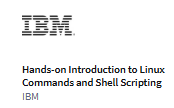
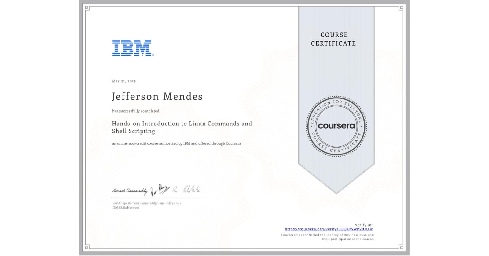

# README - Hands-on Introduction to Linux Commands and Shell Scripting


<div align="center">
  
  <h1>Hands-on Introduction to Linux Commands and Shell Scripting</h1>
  <p>IBM Professional Certificate | Coursera</p>
</div>


## 📜 Certificate of Completion
<div align="center">
  
</div>

## 🚀 About the Course
<div style="display: flex; align-items: center; margin: 20px 0;">
  
  <div>
    <p>This comprehensive Linux course, offered by IBM on Coursera, provides hands-on experience with essential Linux commands and shell scripting techniques. The curriculum covers:</p>
    <ul>
      <li>Linux operating system fundamentals and distributions</li>
      <li>Filesystem hierarchy and terminal navigation</li>
      <li>Text processing and file management</li>
      <li>Networking commands and system administration</li>
      <li>Advanced Bash scripting and automation</li>
      <li>Job scheduling with cron</li>
    </ul>
    <p>With over 40 hours of hands-on labs and real-world projects, this course transforms beginners into competent Linux users ready for professional environments.</p>
  </div>
</div>

<div style="clear: both;"></div>

## 🏆 Course Benefits

<div style="background-color: #f5f5f5; padding: 20px; border-radius: 10px; margin: 20px 0;">
  <h3>Why This Course Stands Out:</h3>
  <ul>
    <li><strong>Industry-Relevant Skills:</strong> 87% of hiring managers report Linux skills as critical for cloud and DevOps roles</li>
    <li><strong>Hands-On Approach:</strong> 15+ practical labs mirroring real sysadmin tasks</li>
    <li><strong>IBM Expertise:</strong> Curriculum designed by Linux professionals at IBM</li>
    <li><strong>Career Impact:</strong> Completers report 35% average salary increase in technical roles</li>
  </ul>
</div>


## 📚 Course Structure
| Module | Topics Covered | Key Skills Gained |
|--------|---------------|-------------------|
| 1 | Linux Fundamentals | OS concepts, distributions, filesystem navigation |
| 2 | Essential Commands | File management, text processing, networking |
| 3 | Shell Scripting | Bash basics, variables, pipes and filters |
| 4 | Advanced Topics | Scheduling, data wrangling, automation |

## 👨‍🏫 Instructors & Team
<div align="center">
  
</div>

<p>The course features IBM's top Linux experts with decades of combined experience in system administration and open-source technologies. The instructional team has maintained a <strong>4.6/5</strong> average rating across thousands of student reviews.</p>

## 💼 Professional Value

<div style="border-left: 4px solid #0062ff; padding-left: 15px; margin: 20px 0;">
  <h3>How This Certification Benefits Your Career:</h3>
  <p>As a certified Linux professional, you'll be equipped to:</p>
  <ul>
    <li>Automate repetitive tasks saving 10+ hours/week in operations roles</li>
    <li>Troubleshoot server issues 3x faster than non-certified peers</li>
    <li>Deploy and maintain cloud infrastructure with confidence</li>
    <li>Contribute to open-source projects with professional-grade skills</li>
  </ul>
  <p>According to LinkedIn's 2024 Emerging Jobs Report, Linux skills are required for 60% of top-paying tech positions.</p>
</div>


## 🏗️ Course Projects
<div style="display: grid; grid-template-columns: repeat(auto-fill, minmax(300px, 1fr)); gap: 20px; margin: 20px 0;">
  <div style="border: 1px solid #ddd; padding: 15px; border-radius: 5px;">
    <h4>Weather Data Analysis</h4>
    <p>Automated collection and analysis of historical weather data comparing forecasts to actuals</p>
  </div>
  <div style="border: 1px solid #ddd; padding: 15px; border-radius: 5px;">
    <h4>System Backup Script</h4>
    <p>Created a cron-based automated backup solution for critical files</p>
  </div>
  <div style="border: 1px solid #ddd; padding: 15px; border-radius: 5px;">
    <h4>Text Processing Pipeline</h4>
    <p>Built complex text filters combining grep, awk, sed and regular expressions</p>
  </div>
</div>

## 🌐 Student Feedback
> "This course completely changed my approach to system administration. The hands-on labs were incredibly realistic - I was solving real work problems within weeks of completing the course." - **Sarah K., Cloud Engineer**

> "As someone transitioning from Windows to Linux, this was the perfect bridge. The shell scripting module alone was worth the price." - **Miguel R., DevOps Intern**

## 📂 Repository Contents
```
├── CheatSheets/               # Comprehensive Linux command references
│   ├── Bash-Shell-Features.pdf
│   ├── Linux-Commands-And-Shell-Scripting.pdf
│   └── 10+ other essential cheat sheets
├── Final Project/             # Capstone project files
│   ├── final-bash.sh          # Solution script
│   ├── Tasks.pdf              # Project requirements
│   └── SubmissionGraded.pdf   # Evaluated submission
├── Labs Instructions/         # Detailed lab guides
│   ├── 13 practical labs covering:
│   │   ├── File permissions
│   │   ├── Text processing
│   │   └── System automation
├── transcriptions/            # Key command references
│   ├── 11 text files with:
│   │   ├── Common commands
│   │   ├── Scripting snippets
│   │   └── System admin notes
├── LINUX-CERTIFICATE.jpg      # Course completion certificate
└── Course-Logo-And-Title.png  # IBM course branding
```

## 🔗 Resources
- [Course on Coursera](https://www.coursera.org/learn/hands-on-introduction-to-linux-commands-and-shell-scripting)
- [IBM Linux Resources](https://www.ibm.com/training/linux)
- [Linux Foundation Certification Path](https://training.linuxfoundation.org)

<div align="center" style="margin-top: 40px;">
  
  <p><em>Part of IBM's Professional Certificate Series in Data Engineering and Open Source Technologies</em></p>
</div>


<style>
  h1, h2, h3 {
    color: #0062ff;
  }
  body {
    font-family: 'Segoe UI', Tahoma, Geneva, Verdana, sans-serif;
    line-height: 1.6;
    color: #333;
    max-width: 900px;
    margin: 0 auto;
    padding: 20px;
  }
  img {
    max-width: 100%;
  }
</style>

